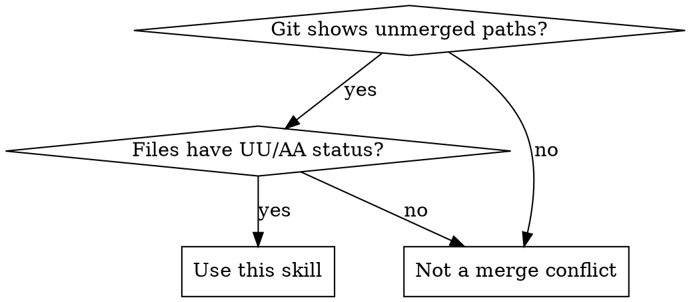
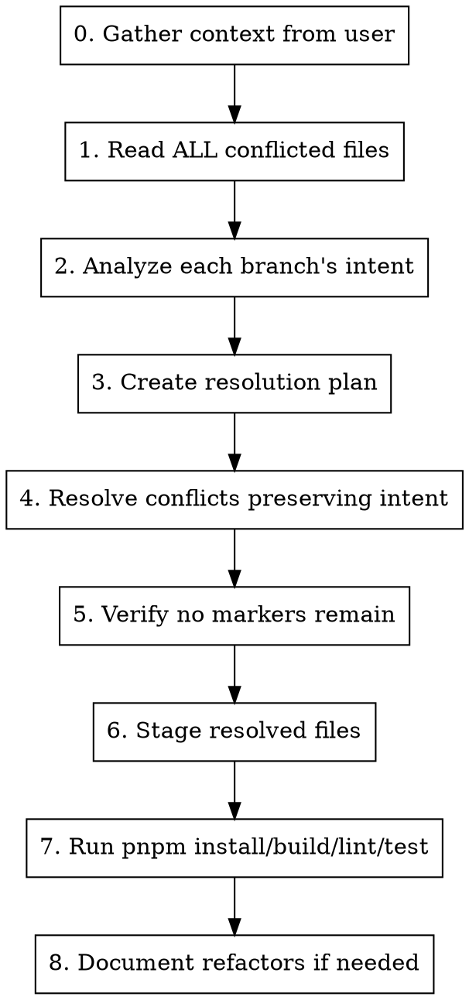

# Resolving Merge Conflicts

## Overview

Merge conflict resolution requires understanding the **intent** of both branches before making changes. Never blindly accept one side - analyze what each branch was trying to accomplish and merge those intentions.

**Core principle:** Preserve intentional changes from all branches while removing only the conflict markers.

## When to Use



**Symptoms:**

- `git status` shows "Unmerged paths" or "both modified"
- Files contain `<<<<<<<`, `=======`, `>>>>>>>` markers
- Git says "fix conflicts and run git commit"
- Status shows `UU` (both modified) or `AA` (both added)

## Conflict Resolution Workflow



### Step 0: Gather Context from User

**Before diving into analysis, ask the user for context that will inform resolution decisions.**

Run `git status` to identify conflicted files, then ask clarifying questions:

1. **What is your branch trying to accomplish?**
   - Understanding the feature/fix helps prioritize which changes to preserve

2. **What are you merging in?** (main, another feature branch, etc.)
   - Helps understand whether incoming changes are "canonical" or experimental

3. **Any specific preferences?**
   - Should one side generally win?
   - Are there files where you know which version to keep?
   - Any changes you specifically want to discard?

4. **How involved do you want to be?**
   - Review each file's resolution plan before I proceed?
   - Proceed autonomously and show summary at end?
   - Only consult on ambiguous cases?

**Example questions to ask:**

```
I see N files with merge conflicts. Before I start resolving:

1. Can you briefly describe what your branch (BRANCH-NAME) is implementing?
2. Are there any specific changes you know you want to keep or discard?
3. Should I proceed autonomously, or would you like to review my resolution plan before I make changes?
```

**Skip this step only if:**

- User has already provided clear context in their request
- Conflicts are trivial (e.g., only lockfile changes)
- User explicitly says "just resolve them"

### Step 1: Read ALL Conflicted Files

Read every file with merge conflicts **before** making any changes. Conflicts are often related - understanding the full picture prevents bad resolutions.

```bash
# Identify conflicted files
git status | grep -E "both (modified|added)"
```

### Step 2: Analyze Each Branch's Intent

**This is the most critical step.** Present a clear analysis to the user before resolving anything.

Create a summary table showing both branches' purposes:

| Branch                     | Intent                                                            |
| -------------------------- | ----------------------------------------------------------------- |
| **HEAD** (your branch)     | [Describe the feature/fix being developed on this branch]         |
| **Incoming** (main/target) | [Describe what changes were added to main that need to be merged] |

For each conflicted file, identify:

| Question                                          | HEAD (current branch) | Incoming branch |
| ------------------------------------------------- | --------------------- | --------------- |
| What feature/fix is this?                         |                       |                 |
| Why was this change made?                         |                       |                 |
| Are these changes complementary or contradictory? |                       |                 |

**Key insight:** Look at branch names, commit messages, and surrounding code to understand intent.

**Ask clarifying questions** when the resolution isn't obvious:

- Data model changes (e.g., string vs number fields)
- Deleted vs modified files
- Conflicting implementation approaches
- Code style preferences (e.g., helper function vs inline logic)

### Step 3: Create Resolution Plan

Before editing, decide how to resolve each file:

| File            | Resolution                                  | Rationale             |
| --------------- | ------------------------------------------- | --------------------- |
| `utils.ts`      | Keep HEAD's implementation                  | This is the bug fix   |
| `mocks/golf.ts` | Merge both - HEAD's logic + incoming's data | Complementary changes |

### Step 4: Resolve Conflicts

Use the Edit tool to replace conflict blocks. A conflict looks like:

```
<<<<<<< HEAD
// Current branch code
=======
// Incoming branch code
>>>>>>> branch-name
```

**Resolution patterns:**

1. **Keep HEAD** - When HEAD has the fix/feature being developed
2. **Keep incoming** - When incoming has better implementation
3. **Merge both** - When changes are complementary (most common)
4. **Rewrite** - When neither version is correct post-merge

### Step 5: Verify No Markers Remain

```bash
# Search for any remaining conflict markers
grep -r "^<<<<<<< \|^=======$\|^>>>>>>> " path/to/files
```

Must return no results before proceeding.

### Step 6: Stage Resolved Files

```bash
# Mark conflicts as resolved
git add <resolved-files>

# Verify status
git status  # Should show "All conflicts fixed but you are still merging"
```

### Step 7: Verify Build and Tests Pass

After staging all resolved files, run verification to ensure the merge didn't break anything:

```bash
# Install dependencies (in case lockfile changed)
pnpm install

# Type check
pnpm tsc --noEmit  # or pnpm run build

# Lint
pnpm lint

# Run tests
pnpm test
```

**Important:** Fix any failures before committing the merge. Common issues:

- Missing imports after accepting one side's changes
- Type mismatches from data model changes
- Broken tests from updated mock data structures

### Step 8: Document Refactors

If resolution reveals needed refactors, create a plan file:

```bash
mkdir -p plan
# Write refactor notes to plan/merge-refactors.md
```

Include:

- Summary of resolution decisions
- Potential follow-up refactors
- Technical debt identified

## Quick Reference

| Conflict Type        | Resolution Strategy                                  |
| -------------------- | ---------------------------------------------------- |
| Import statements    | Usually merge both imports                           |
| Function renames     | Pick one, update all usages consistently             |
| New vs modified file | Merge carefully - new file may lack incoming changes |
| Test data/mocks      | Often merge both for better coverage                 |
| Configuration        | Check if values conflict or can coexist              |

## Common Mistakes

| Mistake                               | Why It's Wrong             | Correct Approach              |
| ------------------------------------- | -------------------------- | ----------------------------- |
| Blindly accepting one side            | Loses intentional changes  | Analyze both branches' intent |
| Editing without reading all conflicts | Miss related changes       | Read all conflicts first      |
| Forgetting to stage resolved files    | Git still sees conflicts   | Run `git add` after editing   |
| Leaving conflict markers              | Breaks code/tests          | Always verify with grep       |
| Not documenting decisions             | Lose context for reviewers | Create resolution summary     |

## Integration with TodoWrite

Track conflict resolution systematically:

```
0. Gather context from user (if needed)
1. Analyze conflict intentions from both branches
2. Resolve <file1> - <decision summary>
3. Resolve <file2> - <decision summary>
...
N. Verify no conflict markers remain
N+1. Stage resolved files
N+2. Run pnpm install/build/lint/test
N+3. Document refactors if needed
```

Mark each todo as completed immediately after finishing that file.
